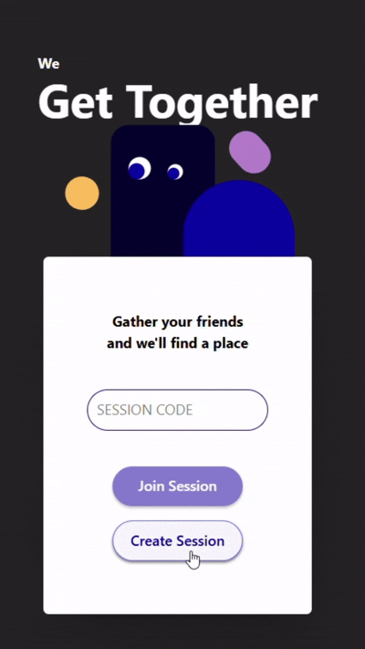

<div align="center">

</div>
<h1 align="center">We Get Together</h1>

<div align="center">


</div>

---

<!-- ## Deployed Site: https://cs484-efkn.web.app -->

## What is We Get Together?
We Get Together is a tool for friends to find a common gathering place. Using session codes, users can join a shared session with real-time updates, share their unique locations, and calculate a midpoint where everyone can meet. Users will get recommended a new restauraunt to try that makes it fair for everyone to meet up at!

Try it out here: https://cs484-efkn.web.app/

## Features
+ **Calculate your midpoint:** Calculate your midpoint with the click of just one button! Using our sophisticated calculations, we'll compute a meeting spot using the locations of all the joined users.
+ **Ease of Access to Route:** Once the midpoint is calculated, we'll generate a route from your address to the midpoint so you can just click-and-go!
+ **Map view:** After midpoint calculation, we also provide a map-view of your position, others' positions, and the midpoint for a helpful visual!
+ **Unique Code Generation:** On set up, hosts can create a session and receive a shareable code with a copy button
+ **Shared sessions:** No more messy group chats and mistyped addresses! Users can do it the simple way by joining a session through a simple 3-step process: enter a code, share your nickname, and give access to your location!
+ **Location retrieval:** We want to make inputting your location as easy as possible. You can either give access to your location (Geolocation API) or input it with the assistance of our address autocompletion (Google Maps API)
+ **Real-time updates and alerts:** You see what everyone else sees! Once the host navigates through the calculation process, you'll see the same information at the same time. Get alerted when a member joins or leaves the session.
+ **View list of members and remove members:** Members and hosts can view all the members in the session; host can remove members

### Features to note:
+ Once the host calculates the midpoint, no other users can join the session
+ If the host ends the session, all other users will be removed from the session and the session will be deleted
+ Firebase anon. auth implemented so user stays in session on refresh
+ Input validation: only a 6-digit join code is allowed, nickname must be validated as well

## UI

<table align="center" border="0" cellpadding="0" cellspacing="0">
  <tr>
    <td align="center">
      <strong>Landing Page</strong><br>
      
    </td>
    <td align="center" width="20"></td> <!-- spacer -->
    <td align="center">
      <strong>Share Location</strong><br>
      
    </td>
  </tr>
</table>


## How to use
```bash
git clone https://github.com/edmuri/We-Get-Together.git
cd We-Get-Together
npm run setup
```
**You will need google api and firebase codes for this to work**

## Contributors
[](https://github.com/edmuri)
[](https://github.com/cheetodustflori)
[](https://github.com/Givikap)
[](https://github.com/nagamaddipudi)
